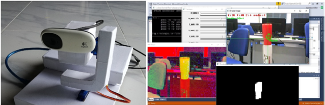

# OpenCV_object_tracking_system
NOTE:
Add opencv-4.5.1, <a href="https://www.youtube.com/embed/bSeFrPrqZ2A">include</a> and vs15 folders into '$(SolutionDir)Dependencies\OpenCV' directory
<h2>Real-time Object Tracking System</h2>

C++ program to track objects (using OpenCV library, IDE Visual studio), sent data through a serial port, and Arduino program for receive data and control server motors.

<a href="https://www.youtube.com/embed/bSeFrPrqZ2A">Tutorial: Real-Time Object Tracking Using OpenCV</a>

